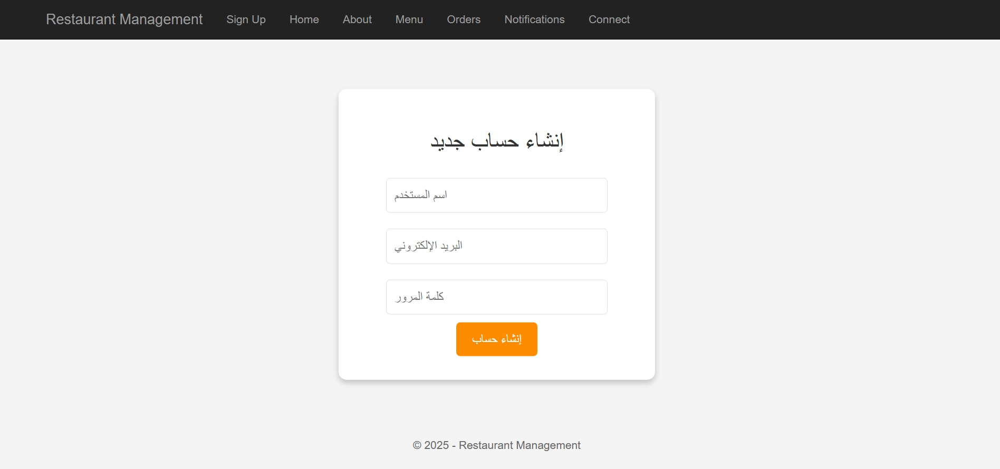
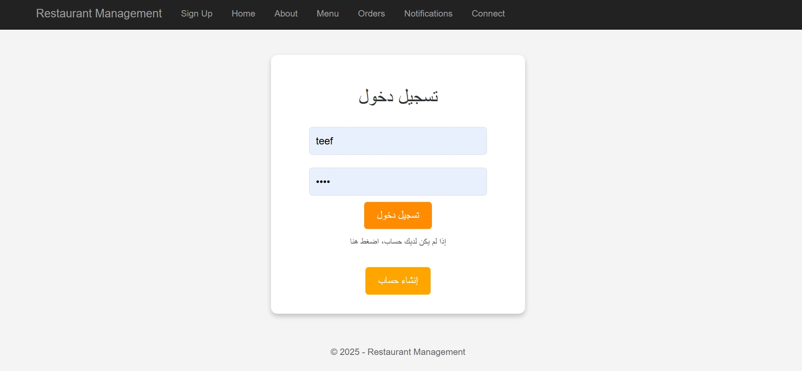

## Restaurant Management System — C# and SQL Server

The Restaurant Management System is a full-featured, server-driven application built using C# (ASP.NET Web Forms) and SQL Server.
The project simulates core restaurant operations such as menu display, order handling, notification management, and customer communication — all implemented using Web Forms controls without manually writing HTML.

This system demonstrates backend development skills, database integration, and complete workflow management in a classic enterprise-style ASP.NET Web Forms environment.

## Project Overview

The application is built using ASP.NET Web Forms with structured page flow, server controls, and backend logic written in C#.
It connects directly to SQL Server to manage data operations such as creating orders, updating menu items, tracking notifications, and handling customer interactions.

## Project Preview

## Core Functionalities

 • Dynamic menu display retrieved from the database
 • Order creation and storage using SQL Server
 • Notification display and status updates
 • Structured pages for information, menu, orders, and communication
 • Consistent UI layout through a Master Page
 • Data management implemented through ADO.NET

System Components
 • ASPX pages for UI rendering
 • C# code-behind files for logic and event handling
 • SQL tables for menu items, orders, notifications, and customer details
 • Web Forms controls such as GridView, TextBox, Button, and Label

## Technologies Used

## C# — ASP.NET Web Forms
 • Page lifecycle handling
 • Server-side event processing
 • Control interactions
 • Business logic implementation

## SQL Server
 • Menu data storage
 • Order records
 • Notifications and customer information
 • Full CRUD operations

## ADO.NET
 • SqlConnection
 • SqlCommand
 • SqlDataReader and DataTable for data retrieval and manipulation

## Visual Studio
 • Development environment for building, debugging, and managing the application

## What This Project Demonstrates

 • Ability to build a functional, database-driven application using C#
 • Strong understanding of ASP.NET Web Forms structure and page lifecycle
 • Practical use of SQL Server and ADO.NET for real data operations
 • Experience developing without manual HTML by relying on Web Forms controls
 • Capability to design and link enterprise-style pages using a Master Page
 • Solid experience with CRUD operations and backend logic

## Developer

Teef M. Karyry — TeefDev
