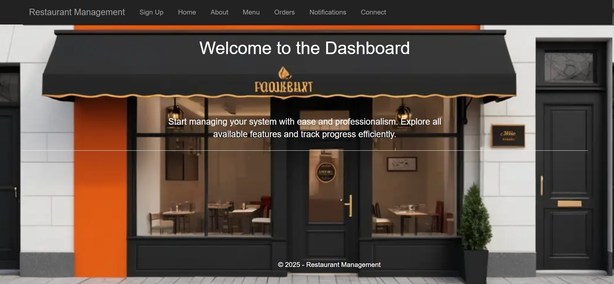
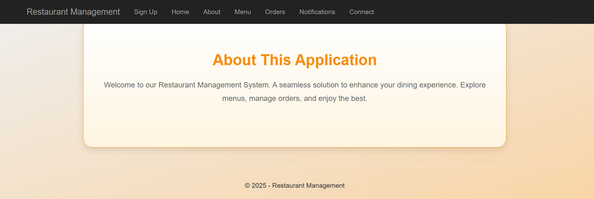
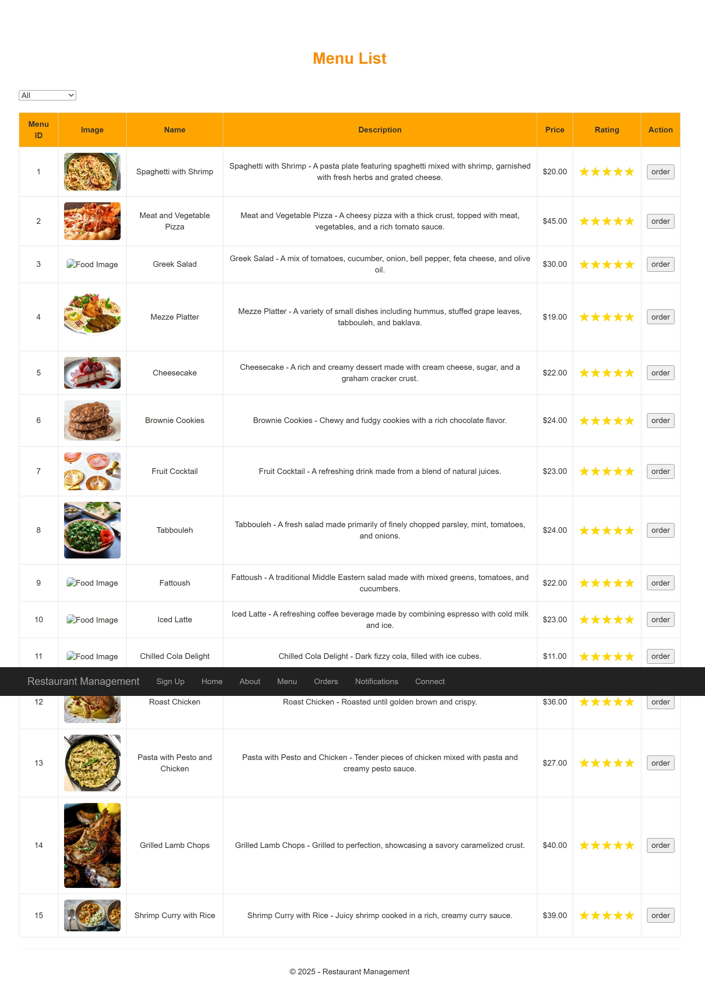
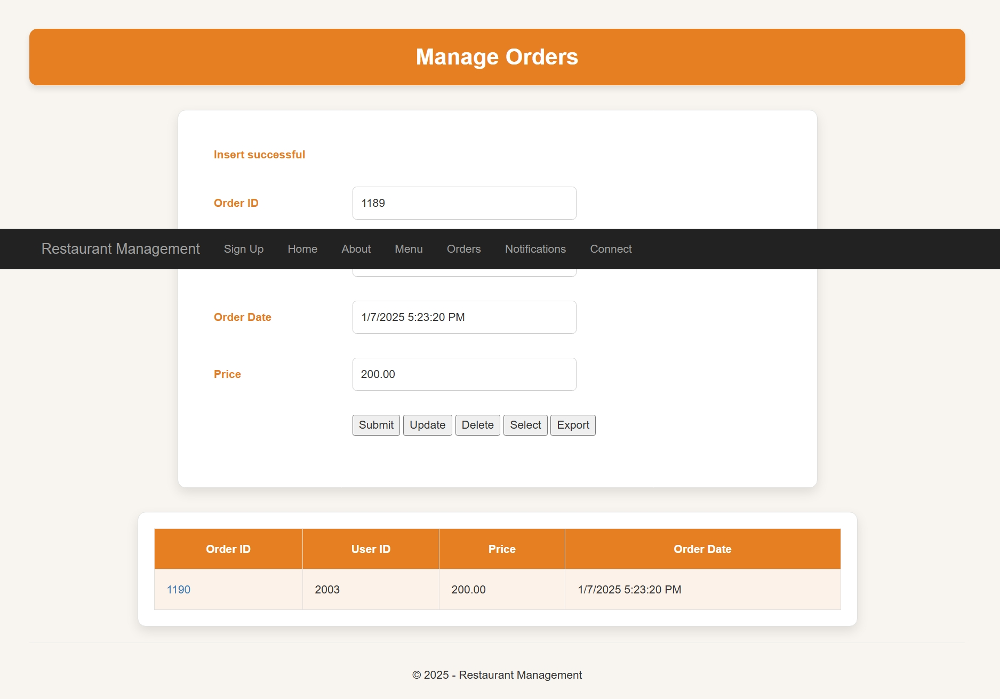
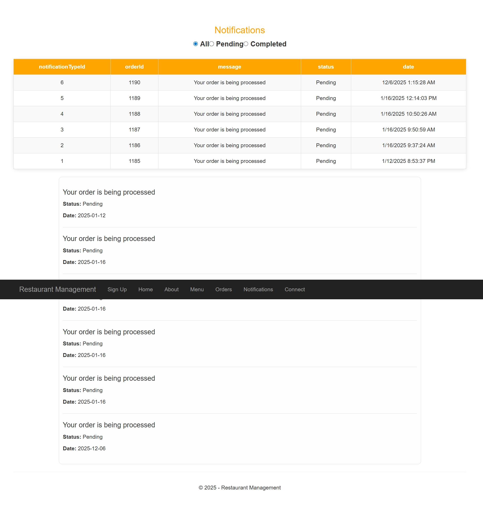
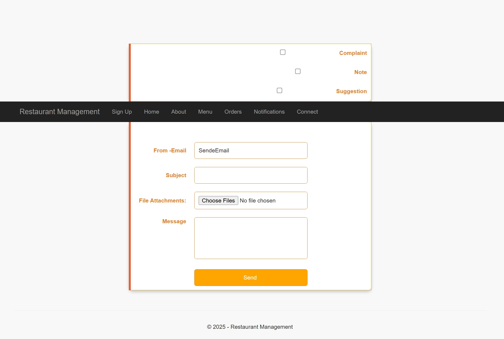

# 🍽️ Restaurant Management System  
# نظام إدارة المطاعم — C# + SQL Server

A full restaurant management system built using C# (ASP.NET Web Forms) and SQL Server, designed to simulate real restaurant operations such as menu display, order processing, notifications, and customer interaction.

This project focuses on server-side development with C#, database-driven logic, and structured page flow using Web Forms — without writing any manual HTML templates.

نظام متكامل لإدارة المطاعم تم تطويره باستخدام لغة C# ضمن ASP.NET Web Forms مع ربط مباشر بقاعدة بيانات SQL Server.  
المشروع يحاكي العمليات الأساسية للمطاعم مثل عرض المنيو، استقبال الطلبات، الإشعارات، والتواصل — وكل ذلك دون كتابة HTML يدوي، اعتمادًا على عناصر Web Forms الجاهزة.

---

## 🖼️ Photo  
صور المشروع:

---

## ✨ Project Overview  
## ✨ نظرة عامة على المشروع

### 🔹 يعتمد المشروع على:
- صفحات ASP.NET Web Forms (.aspx)  
- منطق خلفي مكتوب بـ C# (.cs)  
- اتصال مباشر بـ SQL Server لإدارة البيانات  
- عناصر الويب الجاهزة في Framework مثل:  
  - GridView  
  - TextBox  
  - Button  
  - Label  
  - Master Page  

### 🔹 ويقدم وظائف أساسية:
- عرض قائمة الطعام بشكل ديناميكي  
- إنشاء طلب وحفظه داخل قاعدة البيانات  
- عرض إشعارات وتنبيهات للمستخدم  
- صفحات للتواصل والمعلومات  
- توحيد التصميم باستخدام Master Page  
- إدارة البيانات عبر ADO.NET  

---

## 🛠️ Technologies Used  
## 🛠️ التقنيات المستخدمة

### ✔ C# — ASP.NET Web Forms
- Business Logic  
- Page Lifecycle  
- Events & Controls  
- Form Processing  

### ✔ SQL Server
- تخزين الطلبات  
- بيانات المنيو  
- بيانات الإشعارات والعملاء  
- أوامر CRUD عبر ADO.NET  

### ✔ ADO.NET
- SqlConnection  
- SqlCommand  
- SqlDataReader / DataTable  

### ✔ Visual Studio
- البيئة الأساسية لتطوير المشروع  
- Build & Debug  

---

## 🌟 What This Project Demonstrates  
## 🌟 ماذا يثبت هذا المشروع؟

- بناء نظام حقيقي باستخدام C# + SQL Server  
- فهم كامل لتدفق الصفحات في ASP.NET Web Forms  
- تخزين ومعالجة البيانات عبر ADO.NET  
- استخدام عناصر Web Forms لبناء واجهة دون HTML  
- ربط المشروع بقاعدة بيانات وفهم CRUD  
- تطوير صفحات احترافية بتوحيد تصميم Master Page  

---

## 👩‍💻 Developer  
## 👩‍💻 المطوّرة

Teef M. Karyry — TeefDev  
